# Diagrama de Clases Actualizado - CyacoERP (Angular)

Fecha de actualización: 2026-03-18

Este diagrama está basado en el código real de la app Angular principal y cubre lo que hoy contempla el sitio: landing, catálogo, carrito, cotizaciones, auth, proyectos, blog, contacto, dashboards, administración y capa core.

## Vista General (Mermaid)

```mermaid
classDiagram
%% =========================
%% APP / CORE
%% =========================
class App {
  +templateUrl: app.html
}

class AppRoutes {
  +routes: Routes
  +'' -> LandingComponente
  +catalogo -> CatalogoComponente
  +carrito -> CarritoComponente
  +auth/login -> LoginComponente
  +cotizaciones/mis -> ListaCotizacionesComponente
  +cotizaciones/solicitar -> SolicitarCotizacionComponente
  +proyectos -> ListaProyectosComponente
  +blog -> ListaBlogComponente
  +contacto -> FormularioContactoComponente
}

class AuthGuard {
  +canActivate(route, state) boolean
}

class RoleGuard {
  -authServicio: AuthServicio
  -router: Router
  +tieneRol(rolesPermitidos: string[]) boolean
}

class AuthInterceptor {
  -authServicio: AuthServicio
  +intercept(req, next) Observable~HttpEvent~
}

class Constantes {
  +API_BASE_URL: string
  +ESTADOS_COTIZACION: readonly
  +ESTADOS_PROYECTO: readonly
  +ROLES_USUARIO: readonly
  +CATEGORIES_FAQ: readonly
}

%% =========================
%% SHARED
%% =========================
class Producto {
  +id: number
  +name: string
  +price: number
  +imageUrl: string
  +category: string
  +description: string
  +inStock: boolean
  +brand?: string
  +rating?: number
  +reviews?: number
  +protocols?: string
  +sku?: string
}

class Usuario {
  +id: number
  +nombre: string
  +email: string
  +telefono?: string
  +empresa?: string
  +rol: string
  +activo: boolean
  +fechaRegistro?: Date
}

class NavbarComponente
class FooterComponente {
  +anioActual: number
}

%% =========================
%% AUTH
%% =========================
class LoginRequest {
  +email: string
  +password: string
}

class LoginResponse {
  +token: string
  +usuario: Usuario
}

class AuthServicio {
  -http: HttpClient
  -usuarioActual: BehaviorSubject~Usuario|null~
  +usuarioActual$: Observable~Usuario|null~
  +login(credenciales: LoginRequest) Observable~LoginResponse~
  +registro(datos: any) Observable~LoginResponse~
  +logout() void
  +obtenerToken() string|null
  +estaAutenticado() boolean
  +obtenerUsuarioActual() Usuario|null
  +tieneRol(rol: string) boolean
}

class LoginComponente {
  -authServicio: AuthServicio
  -router: Router
  +email: string
  +password: string
  +cargando: boolean
  +error: string
  +login() void
}

%% =========================
%% CATALOGO / CARRITO
%% =========================
class ProductoServicio {
  -http: HttpClient
  -platformId: Object
  +obtenerTodos() Observable~Producto[]~
  -parsearProductosXml(xmlText: string) Producto[]
  -getTexto(parent, tag) string
  -getNumero(parent, tag) number
  -getBooleano(parent, tag) boolean
}

class ItemCarrito {
  +producto: Producto
  +cantidad: number
}

class CarritoServicio {
  -items: Signal~ItemCarrito[]~
  +itemsCarrito: Signal~ItemCarrito[]~
  +totalItems: Computed~number~
  +totalPrecio: Computed~number~
  +agregarProducto(producto: Producto) void
  +quitarProducto(productoId: number) void
  +actualizarCantidad(productoId: number, cantidad: number) void
  +vaciarCarrito() void
  +generarReciboXml() string
  +descargarReciboXml() void
}

class ModalStateServicio {
  -carritoDrawerAbierto: Signal~boolean~
  +isCarritoDrawerOpen: Signal~boolean~
  +toggleCarritoDrawer() void
  +abrirCarritoDrawer() void
  +cerrarCarritoDrawer() void
}

class ProductoCardComponente {
  +producto: Producto
  +agregarAlCarrito: EventEmitter~Producto~
  +precioFormateado: string
  +onAgregarAlCarrito() void
}

class CatalogoComponente {
  -productoServicio: ProductoServicio
  -carritoServicio: CarritoServicio
  -modalState: ModalStateServicio
  +productosOriginales: Signal~Producto[]~
  +productos: Signal~Producto[]~
  +cargando: Signal~boolean~
  +searchTerm: string
  +sortBy: string
  +ngOnInit() void
  +applyFilters() void
  +onAgregarAlCarrito(producto: Producto) void
  +abrirCarritoPreview() void
}

class CarritoPreviewComponent {
  -carritoServicio: CarritoServicio
  -modalState: ModalStateServicio
  +items() Signal~ItemCarrito[]~
  +totalPrecio() number
  +isOpen() boolean
  +cerrar() void
  +incrementarCantidad(productoId: number) void
  +decrementarCantidad(productoId: number) void
  +removerProducto(productoId: number) void
}

class CarritoComponente {
  -carritoServicio: CarritoServicio
  +items: ItemCarrito[]
  +totalItems: number
  +totalPrecio: number
  +onQuitarProducto(productoId: number) void
  +onActualizarCantidad(productoId: number, evento: Event) void
  +onVaciarCarrito() void
  +onGenerarRecibo() void
}

%% =========================
%% COTIZACIONES
%% =========================
class ItemCotizacion {
  +producto: Producto
  +cantidad: number
  +precioUnitario: number
  +subtotal: number
}

class SolicitudCotizacion {
  +nombreCompleto: string
  +correo: string
  +telefono: string
  +cargo: string
  +empresa: string
  +proyecto: string
  +fechaRequerida: string
  +notas: string
  +items: ItemCotizacion[]
}

class Cotizacion {
  +id: number
  +numero: string
  +usuarioId: number
  +items: ItemCotizacion[]
  +total: number
  +estado: string
  +fechaCreacion: Date
  +fechaPedido?: Date
  +observaciones?: string
  +contacto?: object
  +proyecto?: object
}

class CotizacionServicio {
  -storageKey: string
  -cotizacionesInternas: Signal~Cotizacion[]~
  +cotizaciones: Signal~Cotizacion[]~
  +totalCotizaciones: number
  +obtenerTodas() Observable~Cotizacion[]~
  +obtenerPorId(id: number) Observable~Cotizacion~
  +crear(cotizacion: Cotizacion) Observable~Cotizacion~
  +crearDesdeSolicitud(solicitud: SolicitudCotizacion) Cotizacion
  +actualizar(id: number, cotizacion: Cotizacion) Observable~Cotizacion~
  +eliminar(id: number) Observable~void~
  +solicitarCotizacion(id: number) Observable~Cotizacion~
  +exportarPDF() Observable~Blob~
  +tieneCotizaciones() boolean
  +limpiarCotizacion() void
}

class ListaCotizacionesComponente {
  -cotizacionServicio: CotizacionServicio
  +cotizaciones: Signal~Cotizacion[]~
  +cargando: Signal~boolean~
  +conError: Signal~boolean~
  +ngOnInit() void
  +cargarCotizaciones() void
}

class SolicitarCotizacionComponente {
  -carritoServicio: CarritoServicio
  -cotizacionServicio: CotizacionServicio
  -router: Router
  +formulario: FormGroup
  +itemsCarrito: Signal~ItemCarrito[]~
  +totalEstimado: number
  +sinItems: boolean
  +enviarSolicitud() void
  +formatPrice(price: number) string
  +puedeEnviar() boolean
}

%% =========================
%% PROYECTOS
%% =========================
class Hito {
  +id: number
  +nombre: string
  +descripcion: string
  +porcentajeAvance: number
  +fechaEstimada: Date
  +fechaReal?: Date
}

class Proyecto {
  +id: number
  +nombre: string
  +descripcion: string
  +cliente: string
  +estado: string
  +porcentajeAvance: number
  +hitos: Hito[]
  +fechaInicio: Date
  +fechaFinEstimada: Date
  +gerente?: string
  +presupuesto?: number
}

class ProyectoServicio {
  -http: HttpClient
  +obtenerTodos() Observable~Proyecto[]~
  +obtenerPorId(id: number) Observable~Proyecto~
  +crear(proyecto: Proyecto) Observable~Proyecto~
  +actualizar(id: number, proyecto: Proyecto) Observable~Proyecto~
  +eliminar(id: number) Observable~void~
  +actualizarEstado(id: number, estado: string) Observable~Proyecto~
  +obtenerProyectosActivos() Observable~Proyecto[]~
}

class ListaProyectosComponente {
  -proyectoServicio: ProyectoServicio
  +proyectos: Signal~Proyecto[]~
  +cargando: Signal~boolean~
  +ngOnInit() void
}

%% =========================
%% BLOG
%% =========================
class BlogPost {
  +id: number
  +titulo: string
  +contenido: string
  +autor: string
  +fechaPublicacion: Date
  +tags?: string[]
  +imagenPrincipal?: string
}

class BlogServicio {
  -http: HttpClient
  +obtenerTodos() Observable~BlogPost[]~
  +obtenerPorId(id: number) Observable~BlogPost~
  +crear(post: BlogPost) Observable~BlogPost~
  +actualizar(id: number, post: BlogPost) Observable~BlogPost~
  +eliminar(id: number) Observable~void~
  +obtenerPorTag(tag: string) Observable~BlogPost[]~
}

class ListaBlogComponente {
  -blogServicio: BlogServicio
  +posts: Signal~BlogPost[]~
  +cargando: Signal~boolean~
  +ngOnInit() void
}

%% =========================
%% CONTACTO
%% =========================
class MensajeContacto {
  +id?: number
  +nombre: string
  +email: string
  +telefono?: string
  +asunto: string
  +mensaje: string
  +fechaEnvio?: Date
  +estado?: string
}

class FAQ {
  +id: number
  +pregunta: string
  +respuesta: string
  +categoria: string
}

class ContactoServicio {
  -http: HttpClient
  +enviarMensaje(mensaje: MensajeContacto) Observable~MensajeContacto~
  +obtenerMensajes() Observable~MensajeContacto[]~
  +marcarComoLeido(id: number) Observable~void~
  +responderMensaje(id: number, respuesta: string) Observable~void~
  +obtenerFAQs() Observable~FAQ[]~
  +obtenerFAQsPorCategoria(categoria: string) Observable~FAQ[]~
}

class FormularioContactoComponente {
  -contactoServicio: ContactoServicio
  +nombre: string
  +email: string
  +asunto: string
  +mensaje: string
  +enviado: boolean
  +enviar() void
}

%% =========================
%% DASHBOARDS
%% =========================
class Reporte {
  +id: number
  +nombre: string
  +tipo: string
  +descripcion?: string
  +fechaGeneracion: Date
  +generadoPor: string
  +datos: any
  +formato: string
}

class DashboardVentas {
  +totalVentas: number
  +totalCotizaciones: number
  +cotizacionesAceptadas: number
  +cotizacionesPendientes: number
  +ultimosProductosVendidos: any[]
}

class DashboardClientes {
  +totalClientes: number
  +clientesActivos: number
  +clientesNuevos: number
  +topClientes: any[]
}

class DashboardProyectos {
  +totalProyectos: number
  +proyectosActivos: number
  +proyectosFinalizados: number
  +proximosHitos: any[]
  +porcentajePromedioAvance: number
}

class ReporteServicio {
  -http: HttpClient
  +obtenerDashboardVentas() Observable~DashboardVentas~
  +obtenerDashboardClientes() Observable~DashboardClientes~
  +obtenerDashboardProyectos() Observable~DashboardProyectos~
  +obtenerReportes() Observable~Reporte[]~
  +generarReporte(tipo: string, formato: string, filtros?: any) Observable~Reporte~
  +exportarReporte(id: number, formato: string) Observable~Blob~
  +descargarReporte(id: number, nombreArchivo: string) void
}

class DashboardVentasComponente {
  -reporteServicio: ReporteServicio
  +cargando: Signal~boolean~
  +ngOnInit() void
}

%% =========================
%% ADMIN
%% =========================
class UsuarioServicio {
  -http: HttpClient
  +obtenerTodos() Observable~Usuario[]~
  +obtenerPorId(id: number) Observable~Usuario~
  +crear(usuario: Usuario) Observable~Usuario~
  +actualizar(id: number, usuario: Usuario) Observable~Usuario~
  +eliminar(id: number) Observable~void~
  +obtenerPorRol(rol: string) Observable~Usuario[]~
  +cambiarPassword(id: number, actual: string, nueva: string) Observable~any~
}

class GestionarUsuariosComponente {
  -usuarioServicio: UsuarioServicio
  +usuarios: Signal~Usuario[]~
  +cargando: Signal~boolean~
  +ngOnInit() void
}

%% =========================
%% RELACIONES
%% =========================
App --> NavbarComponente : renderiza
App --> AppRoutes : usa

AuthGuard ..> AuthServicio : valida
RoleGuard ..> AuthServicio : valida rol
AuthInterceptor ..> AuthServicio : token bearer
LoginComponente --> AuthServicio : autentica
AuthServicio --> Usuario
AuthServicio ..> LoginRequest
AuthServicio ..> LoginResponse

CatalogoComponente --> ProductoServicio : consulta productos
CatalogoComponente --> CarritoServicio : agrega al carrito
CatalogoComponente --> ModalStateServicio : abre drawer
CatalogoComponente --> CarritoPreviewComponent : renderiza
ProductoCardComponente --> Producto
ProductoServicio --> Producto

CarritoServicio *-- ItemCarrito
ItemCarrito --> Producto
CarritoPreviewComponent --> CarritoServicio
CarritoPreviewComponent --> ModalStateServicio
CarritoComponente --> CarritoServicio

CotizacionServicio *-- Cotizacion
Cotizacion *-- ItemCotizacion
ItemCotizacion --> Producto
SolicitarCotizacionComponente --> CarritoServicio
SolicitarCotizacionComponente --> CotizacionServicio
ListaCotizacionesComponente --> CotizacionServicio
CotizacionServicio ..> SolicitudCotizacion

Proyecto *-- Hito
ProyectoServicio --> Proyecto
ListaProyectosComponente --> ProyectoServicio

BlogServicio --> BlogPost
ListaBlogComponente --> BlogServicio

ContactoServicio --> MensajeContacto
ContactoServicio --> FAQ
FormularioContactoComponente --> ContactoServicio

ReporteServicio --> Reporte
ReporteServicio --> DashboardVentas
ReporteServicio --> DashboardClientes
ReporteServicio --> DashboardProyectos
DashboardVentasComponente --> ReporteServicio

UsuarioServicio --> Usuario
GestionarUsuariosComponente --> UsuarioServicio

NavbarComponente ..> AppRoutes : navega
FooterComponente ..> AppRoutes : navega
```

## Diagramas segmentados por módulo

- [01-CORE-AUTH.md](diagramas/01-CORE-AUTH.md)
- [02-CATALOGO-CARRITO.md](diagramas/02-CATALOGO-CARRITO.md)
- [03-COTIZACIONES.md](diagramas/03-COTIZACIONES.md)
- [04-ADMIN-USUARIOS.md](diagramas/04-ADMIN-USUARIOS.md)
- [05-PROYECTOS-BLOG-CONTACTO-DASHBOARDS.md](diagramas/05-PROYECTOS-BLOG-CONTACTO-DASHBOARDS.md)

## Recomendación de lectura

- Usa este archivo como diagrama integral del sistema completo.
- Usa los archivos segmentados para detalle por dominio y mejor visibilidad.
