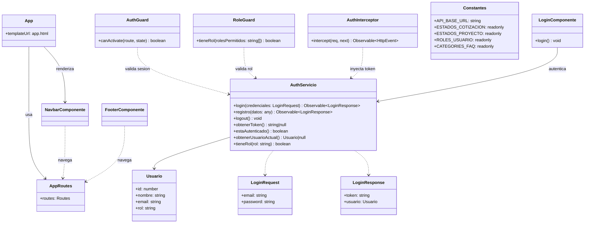

# Diagrama Core + Auth

```mermaid
classDiagram
class App {
  +templateUrl: app.html
}

class AppRoutes {
  +routes: Routes
}

class AuthGuard {
  +canActivate(route, state) boolean
}

class RoleGuard {
  +tieneRol(rolesPermitidos: string[]) boolean
}

class AuthInterceptor {
  +intercept(req, next) Observable~HttpEvent~
}

class Constantes {
  +API_BASE_URL: string
  +ESTADOS_COTIZACION: readonly
  +ESTADOS_PROYECTO: readonly
  +ROLES_USUARIO: readonly
  +CATEGORIES_FAQ: readonly
}

class Usuario {
  +id: number
  +nombre: string
  +email: string
  +rol: string
}

class LoginRequest {
  +email: string
  +password: string
}

class LoginResponse {
  +token: string
  +usuario: Usuario
}

class AuthServicio {
  +login(credenciales: LoginRequest) Observable~LoginResponse~
  +registro(datos: any) Observable~LoginResponse~
  +logout() void
  +obtenerToken() string|null
  +estaAutenticado() boolean
  +obtenerUsuarioActual() Usuario|null
  +tieneRol(rol: string) boolean
}

class LoginComponente {
  +login() void
}

class NavbarComponente
class FooterComponente

App --> AppRoutes : usa
App --> NavbarComponente : renderiza
AuthGuard ..> AuthServicio : valida sesion
RoleGuard ..> AuthServicio : valida rol
AuthInterceptor ..> AuthServicio : inyecta token
LoginComponente --> AuthServicio : autentica
AuthServicio --> Usuario
AuthServicio ..> LoginRequest
AuthServicio ..> LoginResponse
NavbarComponente ..> AppRoutes : navega
FooterComponente ..> AppRoutes : navega
```
