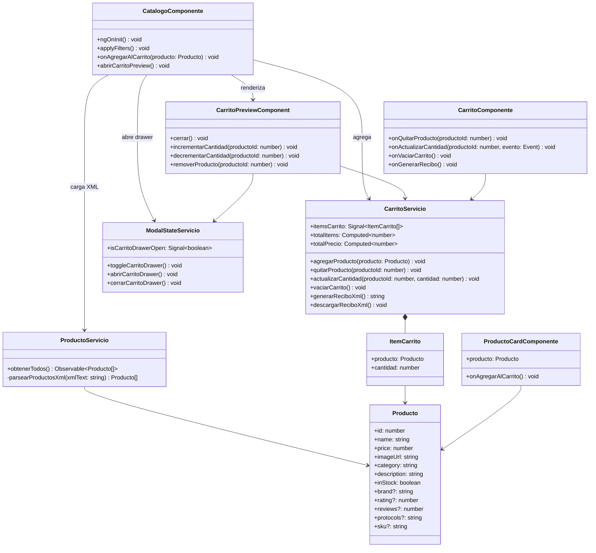

# Diagrama Catalogo + Carrito

```mermaid
classDiagram
class Producto {
  +id: number
  +name: string
  +price: number
  +imageUrl: string
  +category: string
  +description: string
  +inStock: boolean
  +brand?: string
  +rating?: number
  +reviews?: number
  +protocols?: string
  +sku?: string
}

class ProductoServicio {
  +obtenerTodos() Observable~Producto[]~
  -parsearProductosXml(xmlText: string) Producto[]
}

class ItemCarrito {
  +producto: Producto
  +cantidad: number
}

class CarritoServicio {
  +itemsCarrito: Signal~ItemCarrito[]~
  +totalItems: Computed~number~
  +totalPrecio: Computed~number~
  +agregarProducto(producto: Producto) void
  +quitarProducto(productoId: number) void
  +actualizarCantidad(productoId: number, cantidad: number) void
  +vaciarCarrito() void
  +generarReciboXml() string
  +descargarReciboXml() void
}

class ModalStateServicio {
  +isCarritoDrawerOpen: Signal~boolean~
  +toggleCarritoDrawer() void
  +abrirCarritoDrawer() void
  +cerrarCarritoDrawer() void
}

class ProductoCardComponente {
  +producto: Producto
  +onAgregarAlCarrito() void
}

class CatalogoComponente {
  +ngOnInit() void
  +applyFilters() void
  +onAgregarAlCarrito(producto: Producto) void
  +abrirCarritoPreview() void
}

class CarritoPreviewComponent {
  +cerrar() void
  +incrementarCantidad(productoId: number) void
  +decrementarCantidad(productoId: number) void
  +removerProducto(productoId: number) void
}

class CarritoComponente {
  +onQuitarProducto(productoId: number) void
  +onActualizarCantidad(productoId: number, evento: Event) void
  +onVaciarCarrito() void
  +onGenerarRecibo() void
}

ProductoServicio --> Producto
CarritoServicio *-- ItemCarrito
ItemCarrito --> Producto
CatalogoComponente --> ProductoServicio : carga XML
CatalogoComponente --> CarritoServicio : agrega
CatalogoComponente --> ModalStateServicio : abre drawer
CatalogoComponente --> CarritoPreviewComponent : renderiza
ProductoCardComponente --> Producto
CarritoPreviewComponent --> CarritoServicio
CarritoPreviewComponent --> ModalStateServicio
CarritoComponente --> CarritoServicio
```
