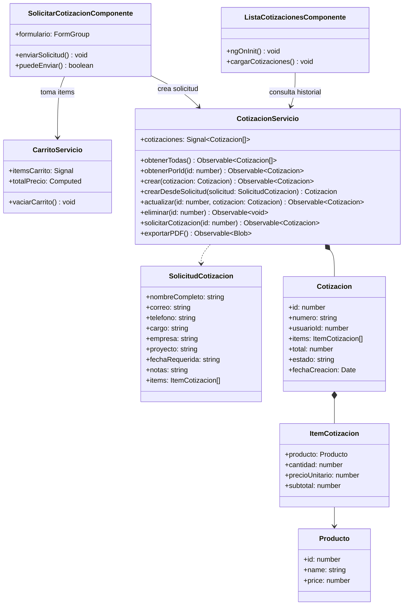

# Diagrama Cotizaciones

```mermaid
classDiagram
class Producto {
  +id: number
  +name: string
  +price: number
}

class ItemCotizacion {
  +producto: Producto
  +cantidad: number
  +precioUnitario: number
  +subtotal: number
}

class SolicitudCotizacion {
  +nombreCompleto: string
  +correo: string
  +telefono: string
  +cargo: string
  +empresa: string
  +proyecto: string
  +fechaRequerida: string
  +notas: string
  +items: ItemCotizacion[]
}

class Cotizacion {
  +id: number
  +numero: string
  +usuarioId: number
  +items: ItemCotizacion[]
  +total: number
  +estado: string
  +fechaCreacion: Date
}

class CarritoServicio {
  +itemsCarrito: Signal
  +totalPrecio: Computed
  +vaciarCarrito() void
}

class CotizacionServicio {
  +cotizaciones: Signal~Cotizacion[]~
  +obtenerTodas() Observable~Cotizacion[]~
  +obtenerPorId(id: number) Observable~Cotizacion~
  +crear(cotizacion: Cotizacion) Observable~Cotizacion~
  +crearDesdeSolicitud(solicitud: SolicitudCotizacion) Cotizacion
  +actualizar(id: number, cotizacion: Cotizacion) Observable~Cotizacion~
  +eliminar(id: number) Observable~void~
  +solicitarCotizacion(id: number) Observable~Cotizacion~
  +exportarPDF() Observable~Blob~
}

class SolicitarCotizacionComponente {
  +formulario: FormGroup
  +enviarSolicitud() void
  +puedeEnviar() boolean
}

class ListaCotizacionesComponente {
  +ngOnInit() void
  +cargarCotizaciones() void
}

Cotizacion *-- ItemCotizacion
ItemCotizacion --> Producto
CotizacionServicio *-- Cotizacion
CotizacionServicio ..> SolicitudCotizacion
SolicitarCotizacionComponente --> CarritoServicio : toma items
SolicitarCotizacionComponente --> CotizacionServicio : crea solicitud
ListaCotizacionesComponente --> CotizacionServicio : consulta historial
```
