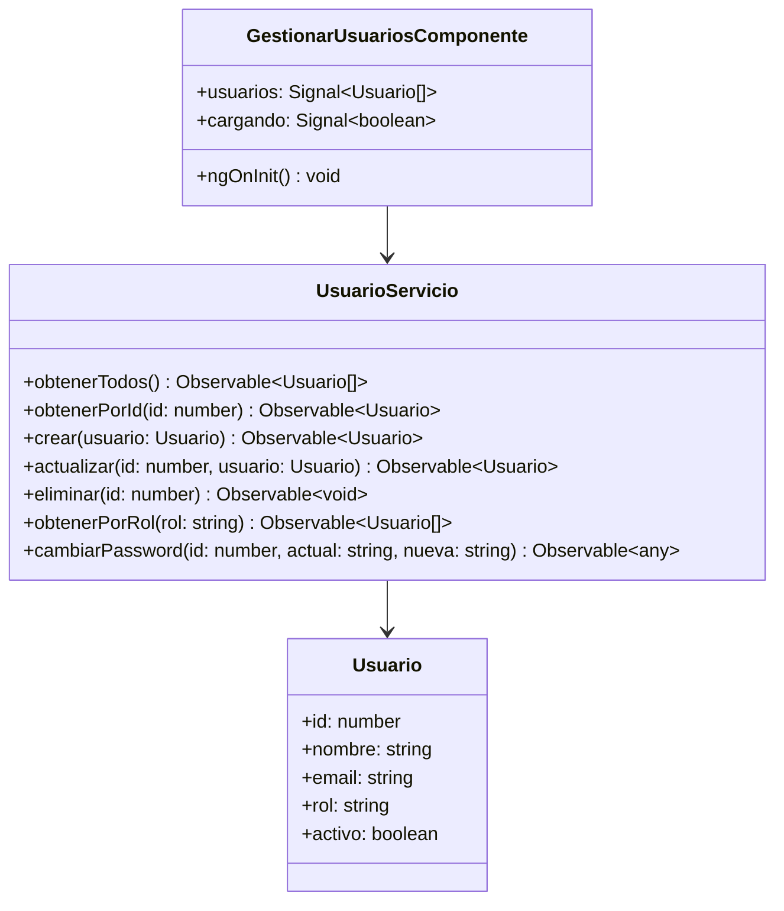

# Diagrama Admin + Usuarios

```mermaid
classDiagram
class Usuario {
  +id: number
  +nombre: string
  +email: string
  +rol: string
  +activo: boolean
}

class UsuarioServicio {
  +obtenerTodos() Observable~Usuario[]~
  +obtenerPorId(id: number) Observable~Usuario~
  +crear(usuario: Usuario) Observable~Usuario~
  +actualizar(id: number, usuario: Usuario) Observable~Usuario~
  +eliminar(id: number) Observable~void~
  +obtenerPorRol(rol: string) Observable~Usuario[]~
  +cambiarPassword(id: number, actual: string, nueva: string) Observable~any~
}

class GestionarUsuariosComponente {
  +usuarios: Signal~Usuario[]~
  +cargando: Signal~boolean~
  +ngOnInit() void
}

GestionarUsuariosComponente --> UsuarioServicio
UsuarioServicio --> Usuario
```
