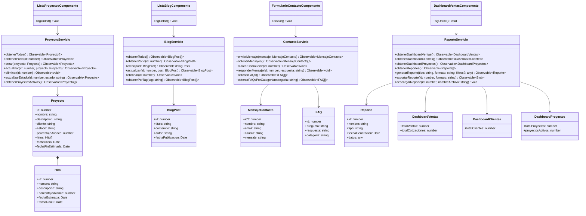

# Diagrama Proyectos + Blog + Contacto + Dashboards

```mermaid
classDiagram
%% PROYECTOS
class Hito {
  +id: number
  +nombre: string
  +descripcion: string
  +porcentajeAvance: number
  +fechaEstimada: Date
  +fechaReal?: Date
}

class Proyecto {
  +id: number
  +nombre: string
  +descripcion: string
  +cliente: string
  +estado: string
  +porcentajeAvance: number
  +hitos: Hito[]
  +fechaInicio: Date
  +fechaFinEstimada: Date
}

class ProyectoServicio {
  +obtenerTodos() Observable~Proyecto[]~
  +obtenerPorId(id: number) Observable~Proyecto~
  +crear(proyecto: Proyecto) Observable~Proyecto~
  +actualizar(id: number, proyecto: Proyecto) Observable~Proyecto~
  +eliminar(id: number) Observable~void~
  +actualizarEstado(id: number, estado: string) Observable~Proyecto~
  +obtenerProyectosActivos() Observable~Proyecto[]~
}

class ListaProyectosComponente {
  +ngOnInit() void
}

%% BLOG
class BlogPost {
  +id: number
  +titulo: string
  +contenido: string
  +autor: string
  +fechaPublicacion: Date
}

class BlogServicio {
  +obtenerTodos() Observable~BlogPost[]~
  +obtenerPorId(id: number) Observable~BlogPost~
  +crear(post: BlogPost) Observable~BlogPost~
  +actualizar(id: number, post: BlogPost) Observable~BlogPost~
  +eliminar(id: number) Observable~void~
  +obtenerPorTag(tag: string) Observable~BlogPost[]~
}

class ListaBlogComponente {
  +ngOnInit() void
}

%% CONTACTO
class MensajeContacto {
  +id?: number
  +nombre: string
  +email: string
  +asunto: string
  +mensaje: string
}

class FAQ {
  +id: number
  +pregunta: string
  +respuesta: string
  +categoria: string
}

class ContactoServicio {
  +enviarMensaje(mensaje: MensajeContacto) Observable~MensajeContacto~
  +obtenerMensajes() Observable~MensajeContacto[]~
  +marcarComoLeido(id: number) Observable~void~
  +responderMensaje(id: number, respuesta: string) Observable~void~
  +obtenerFAQs() Observable~FAQ[]~
  +obtenerFAQsPorCategoria(categoria: string) Observable~FAQ[]~
}

class FormularioContactoComponente {
  +enviar() void
}

%% DASHBOARDS
class Reporte {
  +id: number
  +nombre: string
  +tipo: string
  +fechaGeneracion: Date
  +datos: any
}

class DashboardVentas {
  +totalVentas: number
  +totalCotizaciones: number
}

class DashboardClientes {
  +totalClientes: number
}

class DashboardProyectos {
  +totalProyectos: number
  +proyectosActivos: number
}

class ReporteServicio {
  +obtenerDashboardVentas() Observable~DashboardVentas~
  +obtenerDashboardClientes() Observable~DashboardClientes~
  +obtenerDashboardProyectos() Observable~DashboardProyectos~
  +obtenerReportes() Observable~Reporte[]~
  +generarReporte(tipo: string, formato: string, filtros?: any) Observable~Reporte~
  +exportarReporte(id: number, formato: string) Observable~Blob~
  +descargarReporte(id: number, nombreArchivo: string) void
}

class DashboardVentasComponente {
  +ngOnInit() void
}

Proyecto *-- Hito
ProyectoServicio --> Proyecto
ListaProyectosComponente --> ProyectoServicio

BlogServicio --> BlogPost
ListaBlogComponente --> BlogServicio

ContactoServicio --> MensajeContacto
ContactoServicio --> FAQ
FormularioContactoComponente --> ContactoServicio

ReporteServicio --> Reporte
ReporteServicio --> DashboardVentas
ReporteServicio --> DashboardClientes
ReporteServicio --> DashboardProyectos
DashboardVentasComponente --> ReporteServicio
```
